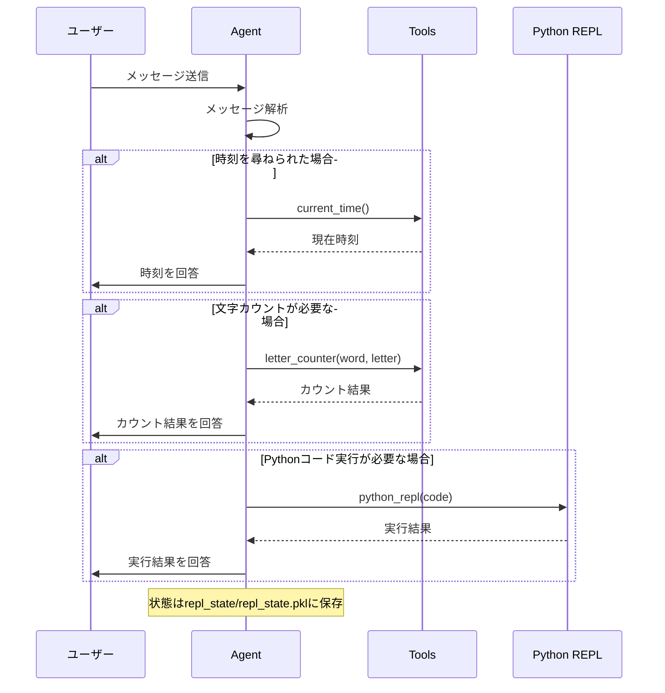

# Strands Agents Study

Strands Agentsフレームワークを使用したAIエージェントの学習プロジェクトです。

## クイックスタート

### 1. 環境準備

```bash
# 依存関係のインストール
uv sync

# 環境変数の設定（必要に応じて）
cp .env.example .env
```

### 2. 基本エージェントの実行

```bash
uv run python agent.py
```

このコマンドにより、以下のツールを持つエージェントが起動します：

- `current_time`: 現在時刻の取得
- `python_repl`: Pythonコードの実行
- `letter_counter`: 文字列内の特定文字をカウント

## エージェントの処理フロー



## 主な特徴

### カスタムツールの定義

`@tool`デコレータを使用してカスタム関数をツール化：

```python
@tool
def letter_counter(word: str, letter: str) -> int:
    return word.lower().count(letter.lower())
```

### セッション状態の永続化

エージェントの会話状態は`repl_state/repl_state.pkl`に自動保存され、セッション間で状態を維持します。

### 組み込みツールの活用

- **current_time**: 日時情報の取得
- **python_repl**: 動的なコード実行とテスト

## プロジェクト構成

```
strands-agents-study/
├── agent.py                 # メインエージェント実装
├── draft/                   # LangSmith統合の実験的実装
├── repl_state/             # エージェント状態の永続化
├── pyproject.toml          # プロジェクト設定とパッケージ依存関係
└── CLAUDE.md               # 開発者向け詳細ドキュメント
```

## 拡張について

より高度な機能（LangSmith統合など）については、`draft/`ディレクトリ内のサンプルを参照してください。詳細な開発情報は`CLAUDE.md`をご覧ください。